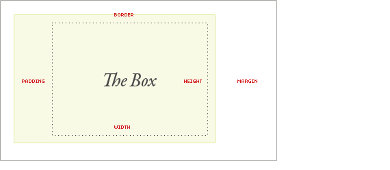

# Welcome (back) to Code Forward fall 2018!
Let's do some more intros to reinforce each other's names, and for the new folks in the room.

## Review of goals for the course
- Learn the fundamentals of creating informational and interactive websites using HTML, CSS and JavaScript
- Become comfortable with programmers' tools such as online documentation, the command line, git, text editors, Glitch, and more
- Gain familiarity with some of the diverse people who write code, what they use code for, and why
  - Software industry professionals!
  - Artists!
  - Activists!
  - Scientists and data analysts!
- Produce a final portfolio project you're proud to show off

## Review of class expectations
- Attendance: please be prompt and come every day, we only have a short time together! You can't get any more out of this course than you put in. Frequent missed classes will mean gaps in your knowledge.
- Participate in all discussions and complete all assignments to the best of your ability, even when you're not sure about something.
- Help your fellow classmates! No disrespect if they get something wrong -- we all do.

## Survey if you didn't take it Tuesday
[Help Nabil with lesson planning!](https://docs.google.com/forms/d/e/1FAIpQLSde01dLh0cFII7EFCU_cAjMxHzFKJHuIJn5NAFb5-ej4lE8qw/viewform)


# Introduction to CSS
## Quick recap of Tuesday
### Account setup
- [github.com](https://github.com)
- [glitch.com](https://glitch.com)

### HTML
Abstract representation -- `<tag>` is not a real HTML tag!

```
<html>
  <head>
    <tag> content </tag>
    <self-closing-tag>
  </head>
  <body>
    <tag attr1="value1" attr2="value2>content </tag>
    <self-closing-tag attr="value1">
    <tag>
      <nested-tag> content </nested-tag>
    </tag>
  </body>
</html>
```
## CSS!
### Introduction to CSS
1. CSS describes how HTML elements are to be displayed on the screen.
2. CSS saves a lot of work. It can control the layout of **multiple** web pages all at **once**.
3. External stylesheets are stored in CSS files and linked to their respective HTML files like this:

```HTML
<html>
  <head>
    <title></title>
    <link rel="stylesheet" href="style.css">
  </head>
  <body>
    <div>
      <h1>Hello, Gakko!</h1>
      <p>This morning I took the A train from Brooklyn. I didn't get to sit down smh. But I saw a boy with a drum. He looked like he was on his way to marching band practice.</p>
    </div>
  </body>
</html>
```

### Abstract CSS Syntax
```
selector {
  property: value;
  property: value;
}
```

### Real CSS examples
```
h1 {
  font-size: 200px;
}

.myClassName {
  color: red;
}

#myId {
  background-image: url("mypic.jpg");
}
```

### The Box Model


- **Content** — The content of the box, where text and images appear.
- **Padding** — Clears an area around the content. The padding is transparent.
- **Border** — A border that goes around the padding and content.
- **Margin** —  Clears an area outside the border. The margin is transparent.


### Exercise: expand your page from Tuesday
Keep working on your blog/portfolio/informational site!

Minimum HTML to include:
- A navigation bar
- A `main` tag for the main content
- Text including: a heading tag, a paragraph tag, a list tag with at least two items
- One image, including alt text
- A link to another page on your own website
- A link to another website
- References to your CSS file on each HTML page

Minimum CSS to include:
- a selector on all instances of a tag
- a selector on a class you defined
- a selector on an id you defined

### Additional resources
[CSS Grid Garden](http://cssgridgarden.com/)
